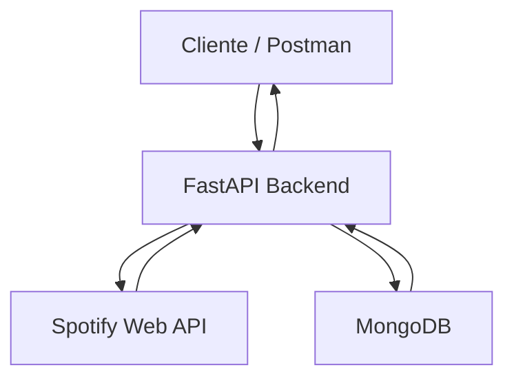

# 🎵 Spotify Mood API

API para recomendación musical basada en estados de ánimo utilizando atributos de audio de Spotify.

## 🧠 Descripción de la API

### 📌 Problema

La sobreoferta de contenido en plataformas de streaming musical ha generado un fenómeno conocido como "fatiga de decisión". Los usuarios de Spotify se enfrentan a millones de canciones disponibles, lo que dificulta encontrar contenido que se alinee con su estado emocional en un momento específico.

Aunque existen listas de reproducción automatizadas, estas no siempre logran capturar de manera precisa el contexto emocional del usuario, lo que limita la experiencia de descubrimiento musical.

---

### 💡 Solución

La API **Spotify Mood API** propone un enfoque basado en el análisis de atributos de audio proporcionados por Spotify (Audio Features), tales como energía, valencia y tempo.

A través de estos datos, la API clasifica y recomienda canciones según estados de ánimo específicos (por ejemplo: feliz, relajado, melancólico o enérgico), permitiendo una experiencia de descubrimiento musical más personalizada, rápida y contextual.

---

### ⚙️ Enfoque técnico

El sistema se basa en una arquitectura de servicios donde:

- Se consumen datos desde la API de Spotify.
- Se procesan atributos musicales relevantes.
- Se aplican reglas o lógica de clasificación para mapear canciones a emociones.
- Se exponen endpoints simples para facilitar su integración con aplicaciones frontend.

Este enfoque permite desacoplar la lógica de negocio y facilitar la escalabilidad del sistema.

## 🏗️ Diagrama de Arquitectura

### 🔄 Flujo general del sistema

El sistema sigue una arquitectura basada en servicios donde el cliente interactúa con una API backend desarrollada en FastAPI. Esta API gestiona la autenticación con Spotify mediante **OAuth 2.0 (Authorization Code with PKCE Flow)**, procesa la lógica de recomendación musical y almacena información relevante en una base de datos MongoDB.

La API también se comunica con la Spotify Web API para obtener datos musicales en tiempo real.



### 🧩 Componentes del sistema

- **Cliente / Frontend**  
  Realiza peticiones HTTP a la API. Para pruebas se utiliza Postman.

- **FastAPI (Backend)**  
  Maneja la lógica de negocio, autenticación con Spotify (OAuth 2.0 Authorization Code Flow) y procesamiento de recomendaciones.

- **MongoDB**  
  Almacena información persistente como perfiles de usuario e historial de recomendaciones.

- **Spotify Web API**  
  Proporciona datos musicales y atributos de audio utilizados para generar recomendaciones.

## 🚀 Requisitos previos

Antes de ejecutar el proyecto, asegúrate de tener instalado lo siguiente:

- **Python** 3.10 o superior
- **MongoDB** (local o en la nube con MongoDB Atlas)
- **Credenciales de Spotify** (Client ID y Client Secret desde el [Spotify Developer Dashboard](https://developer.spotify.com/dashboard))

## 🛠️ Instalación y configuración

**1. Clona el repositorio:**

```bash
git clone https://github.com/tu-usuario/spotify-mood-api.git
cd spotify-mood-api
```

**2. Crea y activa un entorno virtual:**

```bash
python -m venv venv
source venv/bin/activate
venv\Scripts\activate
```

**3. Instala las dependencias:**

```bash
pip install -r requirements.txt
```

**4. Configura las variables de entorno:**

```bash
cp .env.example .env
```

Edita el archivo `.env` con tus credenciales reales (ver sección de [Variables de entorno](#-variables-de-entorno)).

## ▶️ Cómo ejecutar

```bash
uvicorn main:app --reload
```

La API estará disponible en `http://localhost:8000`.  
La documentación interactiva (Swagger UI) estará en `http://localhost:8000/docs`.

## 🐳 Docker

Asegúrate de tener configurado tu archivo `.env` correctamente, de lo contrario los servicios no iniciarán correctamente.

Luego ejecuta:

```bash
docker-compose up --build
```

> La API estará disponible en `http://localhost:8000`.  

## 🌐 Endpoints de la API

### Endpoints de la API

| Método | Ruta | Parámetros | Descripción |
| :--- | :--- | :--- | :--- |
| **GET** | `/users/me` | Ninguno | Obtiene el perfil del usuario autenticado desde Spotify. |
| **PATCH** | `/users/me` | `preferred_moods` | Actualiza información del perfil del usuario. |
| **GET** | `/callback` | `code`, `state` | Endpoint para procesar el código de Spotify e intercambiarlo por tokens. |
| **GET** | `/tracks` | `limit` | Busca pistas de audio en el catálogo local. |
| **GET** | `/users/me/playlists` | Ninguno | Recupera las playlists creadas o seguidas por el usuario. |
| **GET** | `/users/me/recommendations` | `limit`, `genres`, `mood` | Obtiene sugerencias musicales basadas en los gustos del usuario. |
| **POST** | `/users/me/playlists` | `name`, `description` | Crea una nueva playlist en la cuenta de Spotify del usuario. |
| **POST** | `/users/me/recommendations` | `mood`, `track_ids` | Guarda una selección de recomendaciones en la base de datos. |
| **DELETE** | `/users/me/recommendations` | `recommendation_id` | Elimina un registro específico del historial de recomendaciones. |

### 🎭 Valores válidos para `mood`

El parámetro `mood` del endpoint `/recommendations` acepta los siguientes valores:

| Valor         | Estado de ánimo |
| ------------- | --------------- |
| `happy`       | Feliz           |
| `relaxed`     | Relajado        |
| `melancholic` | Melancólico     |
| `energetic`   | Enérgico        |

**Ejemplo de uso:**

```
GET /recommendations?mood=happy
```

### 📌 Notas de diseño

- La API sigue principios REST para mantener claridad y escalabilidad.
- Las rutas están diseñadas para ser intuitivas y fáciles de consumir.
- Se prioriza el uso de métodos HTTP adecuados (GET, POST).
- Las respuestas se devuelven en formato JSON para facilitar la integración con clientes frontend.

## 🗄️ Modelo de Datos (MongoDB)

### 📌 Descripción

El sistema utiliza MongoDB como base de datos NoSQL para almacenar información de usuarios y el historial de recomendaciones. Esto permite flexibilidad en la estructura de datos y escalabilidad en el manejo de información.

### 👤 Colección: users

```json
{
  "spotify_id": "string",
  "display_name": "string",
  "preferred_moods": ["string"],
  "created_at": "timestamp"
}
```

**Campos:**

- `spotify_id`: Identificador único del usuario en Spotify.
- `display_name`: Nombre visible del usuario.
- `preferred_moods`: Lista de estados de ánimo preferidos para personalización.
- `created_at`: Fecha de registro del usuario en el sistema.

### 🎧 Colección: recommendations_history

```json
{
  "user_id": "string",
  "mood": "string",
  "tracks": [
    {
      "id": "string",
      "name": "string",
      "artist": "string"
    }
  ],
  "timestamp": "datetime"
}
```

**Campos:**

- `user_id`: Referencia al usuario que solicitó la recomendación.
- `mood`: Estado de ánimo utilizado para la recomendación.
- `tracks`: Lista de canciones recomendadas.
- `timestamp`: Fecha y hora de la recomendación.

## 🔐 Gestión de Seguridad y Entorno

### 🚨 Política de Seguridad

Este proyecto sigue la política de:

**"Cero credenciales en el repositorio"**

Ninguna clave, token o configuración sensible debe ser subida a GitHub.

### 📄 Variables de entorno

Se utiliza un archivo `.env` para gestionar configuraciones sensibles.

Ejemplo (`.env.example`):

```env
SPOTIFY_CLIENT_ID=your_client_id_here
SPOTIFY_CLIENT_SECRET=your_client_secret_here
SPOTIFY_REDIRECT_URI=http://localhost:8000/callback

MONGO_URI=mongodb://localhost:27017
```
